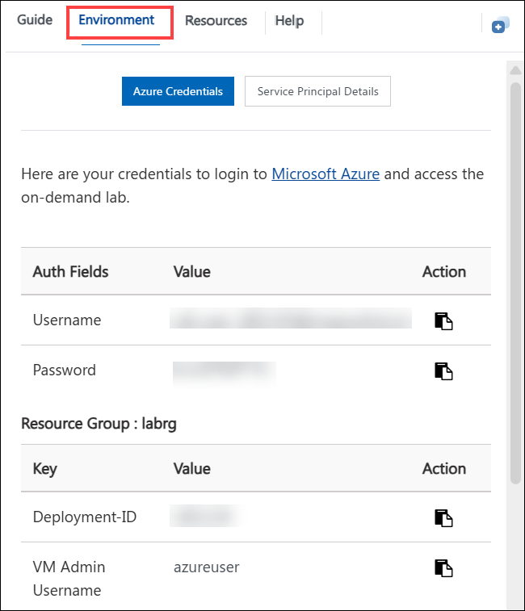
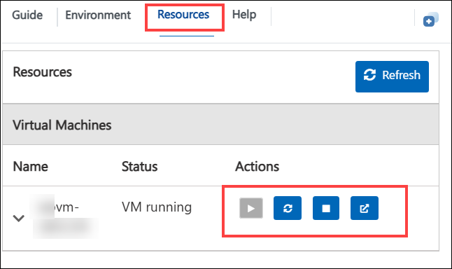

# Getting Started with Lab 1: Import and Configure an API with Azure API Management

### Estimated Duration: 40 Minutes

## Overview

Welcome to **Lab 1: Import and Configure an API with Azure API Management (APIM)**.  
In this lab, you will learn how to create an Azure API Management instance, import an API from an OpenAPI specification, configure backend settings, and test API operations. By the end of this lab, you will understand how APIM manages APIs, applies policies, and exposes APIs securely and consistently.

This Getting Started guide will help you navigate your virtual environment, access your lab resources, and prepare your Azure workspace before you begin the exercises.

## Lab Objectives

By completing this lab, you will learn to:

- Create an Azure API Management (APIM) instance  
- Import an API using an OpenAPI specification  
- Configure backend API settings  
- Test API operations in the Azure Portal  

## Accessing Your Lab Environment

Your virtual machine (VM) and lab guide are available directly in your browser.

### Virtual Machine Access

Once the lab launches, your VM will appear on the left:

### Lab Guide Access

Your lab guide will be visible on the right side for easy reference throughout the exercises.

## Exploring Your Lab Resources

Navigate to the **Environment** tab to view all required lab credentials and Azure resource details:

## Using Split-Window Mode

To open the lab guide in a separate window, click **Split Window** from the top right:

## Managing Your Virtual Machine

You can **Start**, **Stop**, or **Restart** your VM at any time under the **Resources** tab:

## Adjusting Zoom

To zoom in or out within the lab interface, use the **A↕ 100%** zoom button:

## Getting Started with Azure Portal

Follow the steps below to sign into Azure on your virtual machine.

1. Click the **Azure Portal** icon on the VM desktop:  
   

2. Enter your username:  
   **Email/Username:** `<inject key="AzureAdUserEmail"></inject>`  
   

3. Enter your password:  
   **Password:** `<inject key="AzureAdUserPassword"></inject>`  
   

4. If prompted with **Stay signed in?**, select **No**:  
   

## Support

CloudLabs support is available **24/7** to assist you.

### Learner Support Contacts
- **Email:** cloudlabs-support@spektrasystems.com  
- **Live Chat:** https://cloudlabs.ai/labs-support  

If you experience login issues, portal errors, or VM problems, reach out anytime.

## Proceed to the Lab

Click **Next** in the bottom-right corner to begin **Exercise 1: Create an API Management Instance**.

## You’re all set! Enjoy your lab experience.
