# Lab 2: Azure authentication and authorization

## Lab Scenario

In this exercise, you register an application in Microsoft Entra ID and build a .NET console application that uses MSAL.NET to authenticate a user interactively. You'll configure scopes, prompt for user consent, and observe how MSAL caches tokens for future runs.

## Lab Objectives
In this lab, you will perform:

- Register a new application
- Create a .NET console app to acquire a token
- Configure backend settings
- Test the API

## Estimated Timing: 20 Minutes

### Exercise 1: Implement interactive authentication with MSAL.NET

### Task 1: Register a new application

1. In your browser navigate to the Azure portal [https://portal.azure.com](https://portal.azure.com); signing in with your Azure credentials if prompted.

1. In the portal, search for **App registrations (1)** and select **App registrations (2)**. 

     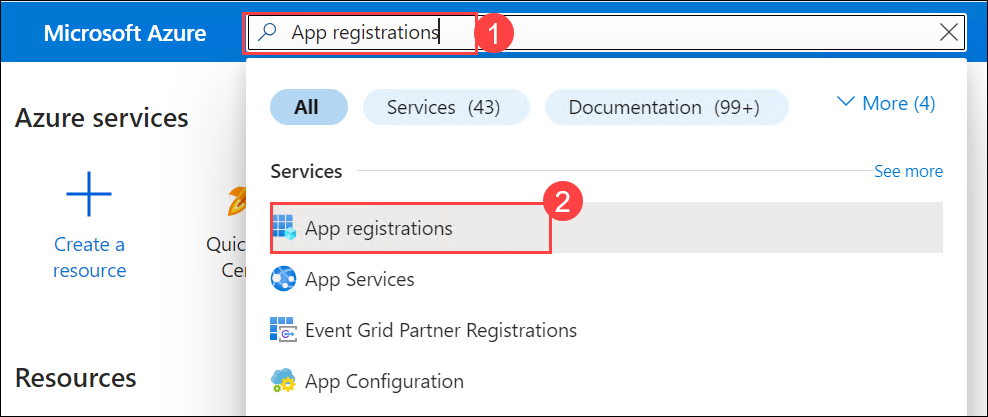

1. Select **+ New registration**, and when the **Register an application** page appears, enter your application's registration information:

    | Field | Value |
    |--|--|
    | **Name** | Enter `myMsalApplication` **(1)** |
    | **Supported account types** | Select **Accounts in this organizational directory only (2)** |
    | **Redirect URI (optional)** | Select **Public client/native (mobile & desktop) (3)** and enter `http://localhost` **(4)** in the box to the right. |

     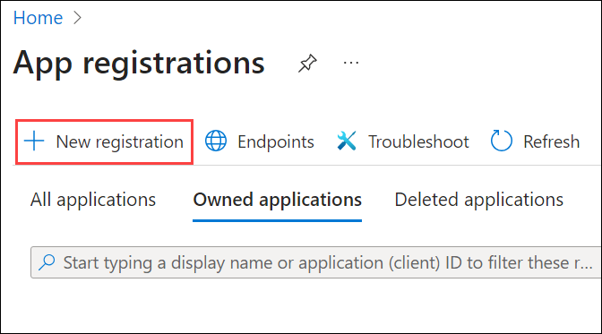

     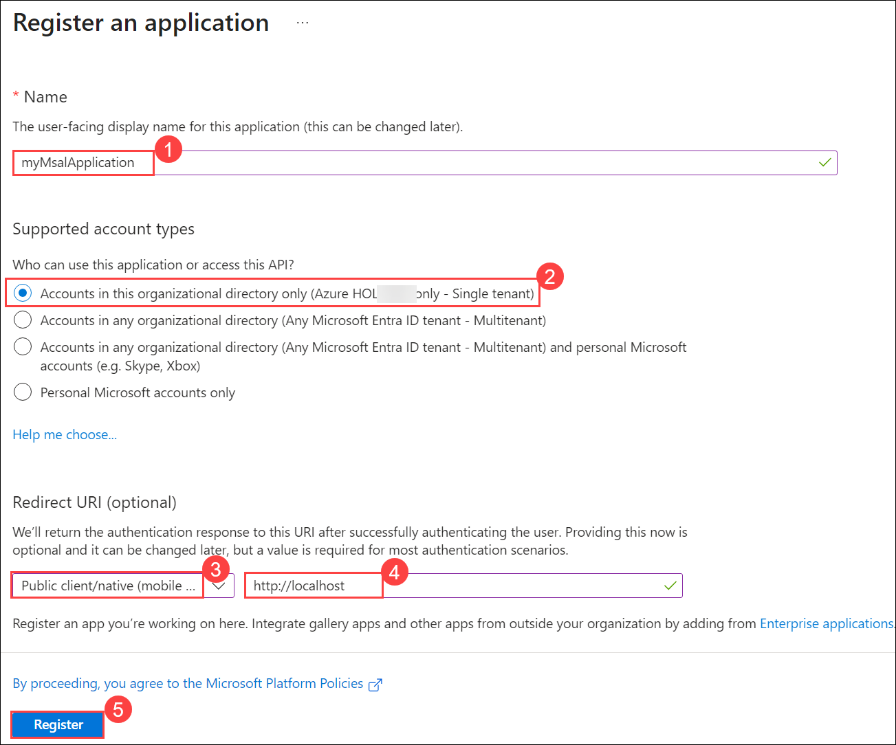

1. Select **Register (5)**. Microsoft Entra ID assigns a unique application (client) ID to your app, and you're taken to your application's **Overview** page. 

1. In the **Essentials** section of the **Overview** page record the **Application (client) ID (1)** and the **Directory (tenant) ID (2)**. The information is needed for the application.

    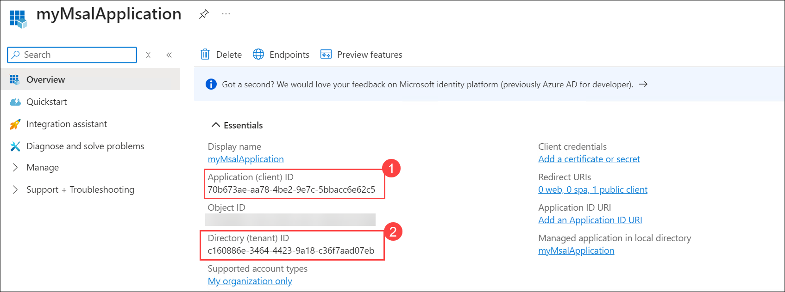
 
### Task 2: Create a .NET console app to acquire a token

Now that the needed resources are deployed to Azure the next step is to set up the console application. The following steps are performed in your local environment.

1. Open **File Explorer**, navigate to the **Downloads** folder, and create a new folder named **authapp** for the project.

     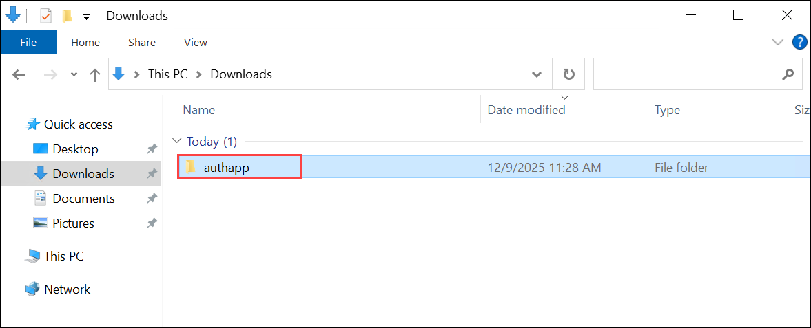

1. In Lab VM open the Start menu, search for **Visual Studio Code (1)**, and select **Visual Studio Code (2)** to launch the application.

     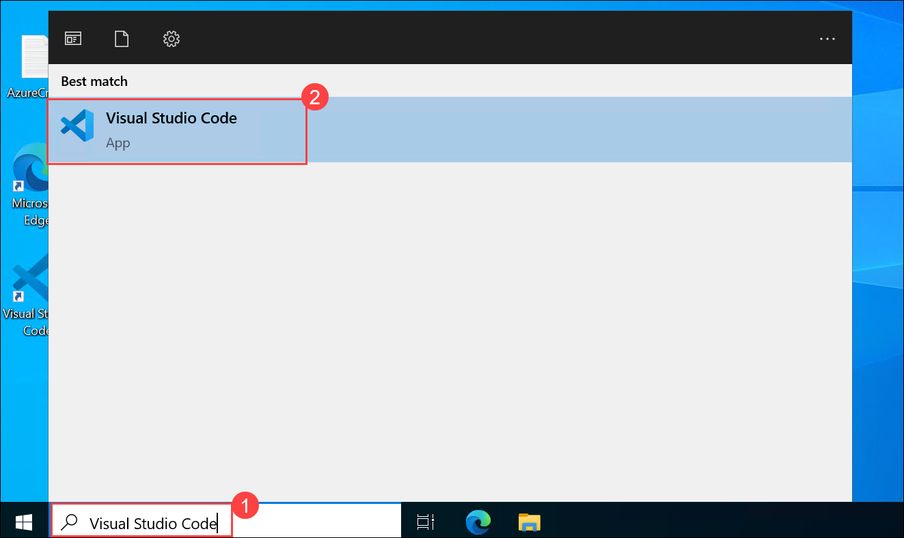

1. In Visual Studio Code, select **File (1)** and choose **Open Folder (2)**

     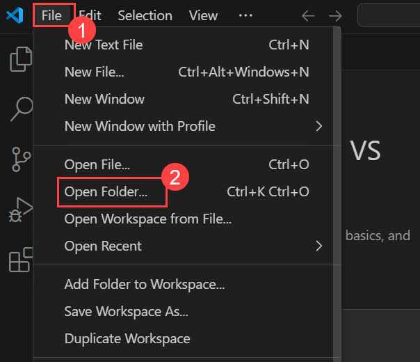

1. In the Open Folder window, navigate to the **Downloads (1)** directory, select the **authapp (2)** folder, and then choose **Select Folder (3)** to open it in Visual Studio Code.

     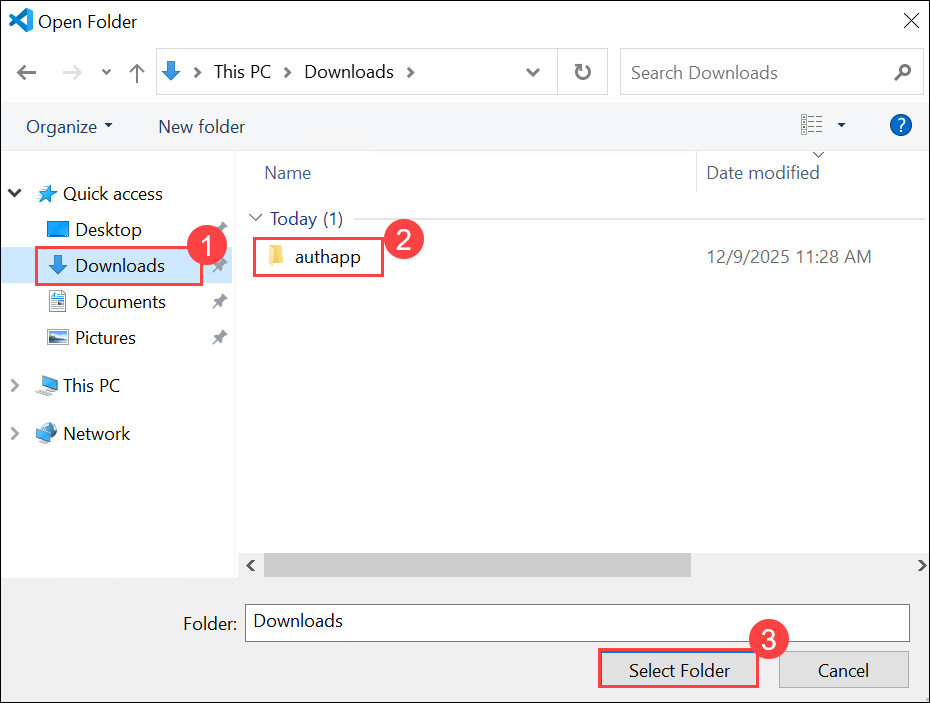

     > **Note:** When prompted with a security message asking **"Do you trust the authors of the files in this folder?"**, select **Yes, I trust the authors** to allow Visual Studio Code to fully load the project.

1. In Visual Studio Code, open the **Extensions (1)** view, search for **C# Dev Kit (2)**, select it **C# Dev Kit (3)** from the results, and choose **Install (4)**.

     

1. In Visual Studio Code, on the top menu, select **View (1) > Terminal (2)** to open a new terminal window.

     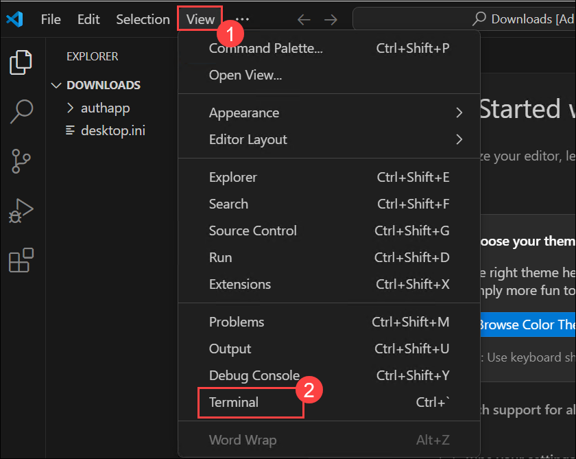

1. Run the following command in the VS Code terminal to create the .NET console application.

    ```
    dotnet new console
    ```

1. Run the following commands to add the **Microsoft.Identity.Client** and **dotenv.net** packages to the project.

    ```
    dotnet add package Microsoft.Identity.Client
    dotnet add package dotenv.net
    ```

### Task 3: Configure the console application

In this section you create, and edit, a **.env** file to hold the secrets you recorded earlier. 

1. Select **New file...** and create a file named *.env* in the project folder.

     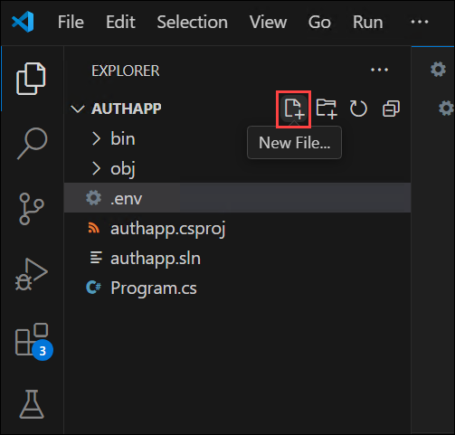

1. Open the **.env (1)** file and add the following code. Replace **YOUR_CLIENT_ID**, and **YOUR_TENANT_ID** with the values you recorded earlier **(2)**.

    ```
    CLIENT_ID="YOUR_CLIENT_ID"
    TENANT_ID="YOUR_TENANT_ID"
    ```

    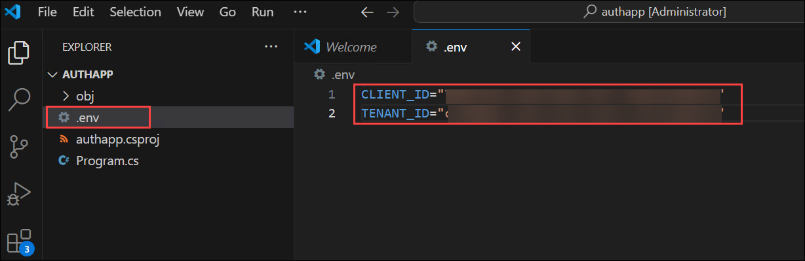

1. Press **ctrl+s** to save your changes.

### Task 4: Add the starter code for the project

1. Open the *Program.cs* **(1)** file and replace any existing contents with the following code **(2)**. Be sure to review the comments in the code.

    ```csharp
    using Microsoft.Identity.Client;
    using dotenv.net;
    
    // Load environment variables from .env file
    DotEnv.Load();
    var envVars = DotEnv.Read();
    
    // Retrieve Azure AD Application ID and tenant ID from environment variables
    string _clientId = envVars["CLIENT_ID"];
    string _tenantId = envVars["TENANT_ID"];
    
    // ADD CODE TO DEFINE SCOPES AND CREATE CLIENT 
    
    
    
    // ADD CODE TO ACQUIRE AN ACCESS TOKEN
    
    
    ```

     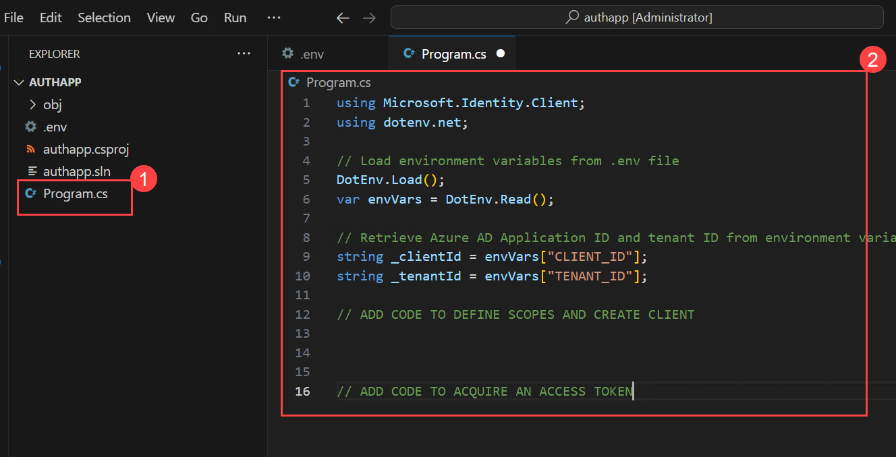

1. Press **ctrl+s** to save your changes.

### Add code to complete the application

1. Locate the **// ADD CODE TO DEFINE SCOPES AND CREATE CLIENT** comment and add the following code directly after the comment. Be sure to review the comments in the code.

    ```csharp
    // Define the scopes required for authentication
    string[] _scopes = { "User.Read" };
    
    // Build the MSAL public client application with authority and redirect URI
    var app = PublicClientApplicationBuilder.Create(_clientId)
        .WithAuthority(AzureCloudInstance.AzurePublic, _tenantId)
        .WithDefaultRedirectUri()
        .Build();
    ```

    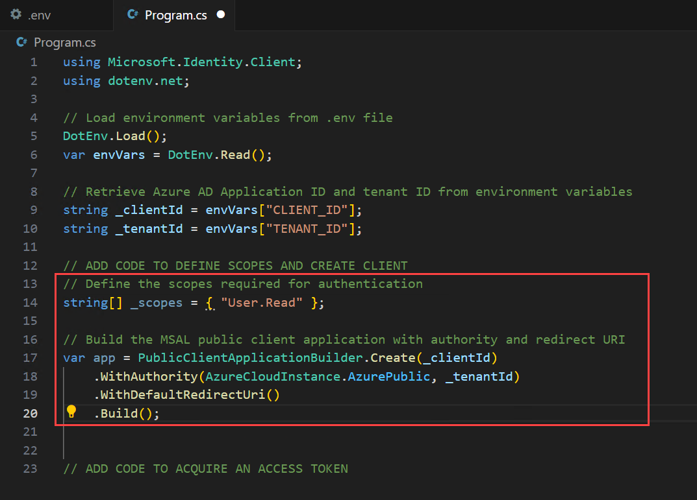

1. Locate the **// ADD CODE TO ACQUIRE AN ACCESS TOKEN** comment and add the following code directly after the comment. Be sure to review the comments in the code.

    ```csharp
    // Attempt to acquire an access token silently or interactively
    AuthenticationResult result;
    try
    {
        // Try to acquire token silently from cache for the first available account
        var accounts = await app.GetAccountsAsync();
        result = await app.AcquireTokenSilent(_scopes, accounts.FirstOrDefault())
                    .ExecuteAsync();
    }
    catch (MsalUiRequiredException)
    {
        // If silent token acquisition fails, prompt the user interactively
        result = await app.AcquireTokenInteractive(_scopes)
                    .ExecuteAsync();
    }
    
    // Output the acquired access token to the console
    Console.WriteLine($"Access Token:\n{result.AccessToken}");
    ```

    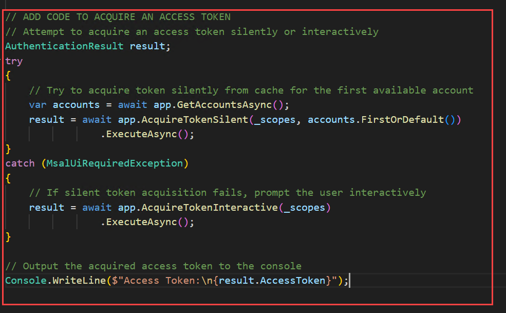

1. Press **ctrl+s** to save the file

### Task 5: Run the application

Now that the app is complete it's time to run it. 

1. Start the application by running the following command:

    ```
    dotnet run
    ```

1. The app opens the default browser prompting you to select the account you want to authenticate with.

    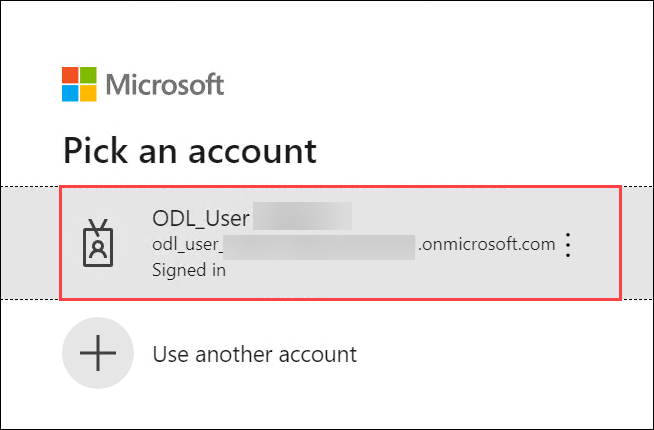

1. If this is the first time you've authenticated to the registered app you receive a **Permissions requested** notification asking you to approve the app to sign you in and read your profile, and maintain access to data you have given it access to. Select **Accept**.

    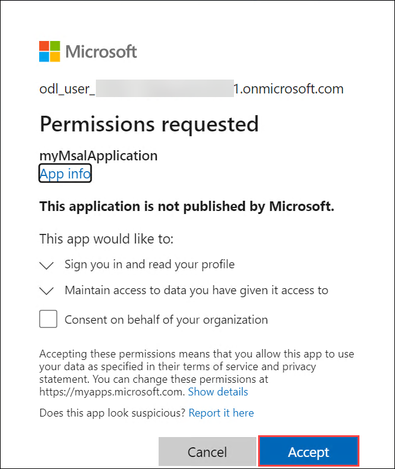

1. You should see the results similar to the example below in the console.

    ```
    Access Token:
    eyJ0eXAiOiJKV1QiLCJub25jZSI6IlZF.........
    ```

     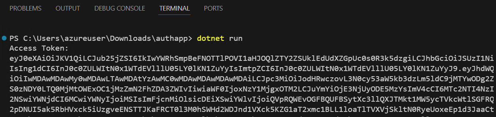

1. Start the application a second time and notice you no longer receive the **Permissions requested** notification. The permission you granted earlier was cached.

