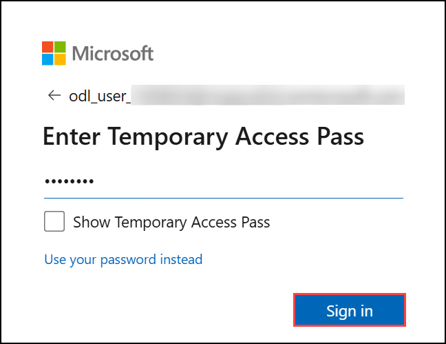

# Getting Started with Lab 02: Implement Interactive Authentication & Microsoft Graph Integration

Welcome to **Lab 02**, which contains two modules focusing on authentication and Microsoft Graph integration using .NET.  
This Getting Started page provides the required environment setup, access instructions, navigation guidance, and support information.

---

## Lab Overview

This lab includes the following two modules:

### Module 1 — Interactive Authentication with MSAL.NET
You will:
- Register an application in Microsoft Entra ID  
- Create a .NET console application  
- Implement `PublicClientApplicationBuilder`  
- Acquire tokens interactively using the `User.Read` scope  

### Module 2 — Retrieve User Profile with Microsoft Graph SDK
You will:
- Register a Microsoft Graph-enabled application  
- Create a .NET console app with interactive authentication  
- Use `GraphServiceClient` to retrieve user profile information  

**Estimated Duration:** Approximately 30 minutes

---

## Accessing Your Lab Environment

Your virtual machine and lab guide will load directly in your browser.

### Virtual Machine Access
You will see your VM loading on the left side of the interface:

### Lab Guide Access
The lab guide appears on the right panel and will assist you throughout the exercises.

---

## Exploring Lab Resources

Navigate to the **Environment** tab to view your lab credentials and resource details:

---

## Split-Window Feature

To open the lab guide in a separate window, select **Split Window**:

---

## Managing Your Virtual Machine

Start, stop, or restart your virtual machine at any time using the **Resources** tab:

---

## Adjusting Zoom

To adjust the zoom level of the lab environment, use the **A↕ 100%** button located near the timer:

---

## Accessing Azure Portal

Follow these steps to begin working in Azure:

1. On the VM desktop, select the **Azure Portal** icon:

   

2. Enter your credentials:
   - **Email/Username:** `<inject key="AzureAdUserEmail"></inject>`

     

3. Enter your password:
   - **Password:** `<inject key="AzureAdUserPassword"></inject>`

     

4. If prompted with **Stay signed in**, select **No**.

   

---

## Support

CloudLabs provides **24/7 dedicated support** to all learners.

**Learner Support Contacts:**
- Email: cloudlabs-support@spektrasystems.com  
- Live Chat: https://cloudlabs.ai/labs-support  

For any VM, login, or Azure environment issues, feel free to reach out at any time.

---

## Move to the Next Page

Select **Next** at the bottom-right corner to begin **Module 1**.

## Happy Learning!