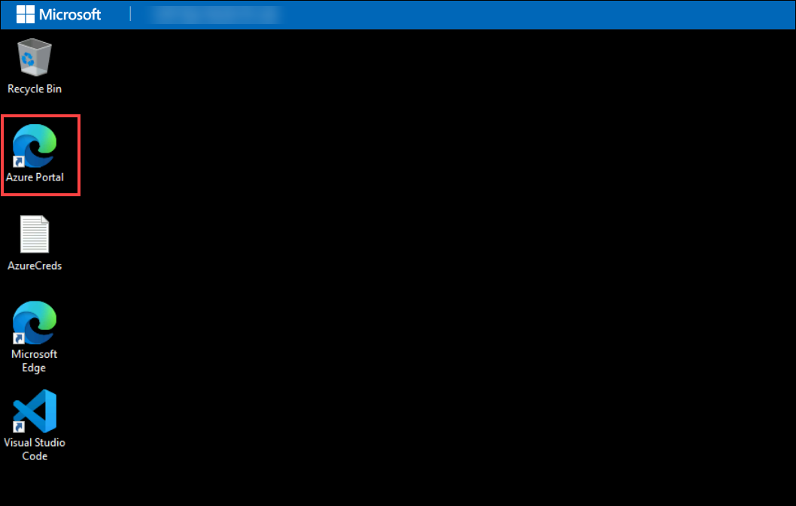

# Getting Started with Lab 03: Monitor an Application with Autoinstrumentation

Welcome to **Lab 03: Monitor an Application with Autoinstrumentation**.  
This Getting Started page provides essential environment setup instructions, navigation guidance, and support information before you begin the hands‑on exercises.

---

## Lab Overview

In this lab, you will:

- Create a web app resource with Application Insights enabled  
- Configure instrumentation for the web app  
- Create and deploy a Blazor application  
- View application activity and telemetry in Application Insights  

**Estimated Duration:** 20 minutes

---

## Accessing Your Lab Environment

Your virtual machine and lab guide are available within the CloudLabs interface.

### Virtual Machine Access
You will see your VM loading on the left side of the lab environment:

### Lab Guide Access
The lab guide appears on the right-hand panel.

---

## Exploring Lab Resources

Navigate to the **Environment** tab to view credentials and resource details:

---

## Split‑Window Feature

To view the lab guide in a separate window, select **Split Window**:

---

## Managing Your Virtual Machine

Start, stop, or restart your virtual machine using the **Resources** tab:

---

## Adjusting Zoom

Modify the zoom level using the **A↕ 100%** control near the timer:

---

## Accessing Azure Portal

Follow these steps to begin working in Azure:

1. From the VM desktop, select the **Azure Portal** icon:

   

2. Enter your assigned credentials:

   - **Email/Username:** `<inject key="AzureAdUserEmail"></inject>`

     

3. Enter your password:

   - **Password:** `<inject key="AzureAdUserPassword"></inject>`

     

4. If prompted to **Stay signed in**, choose **No**.

   

---

## Support

CloudLabs provides **24/7 support** for all learners.

**Learner Support Contacts:**  
- Email: cloudlabs-support@spektrasystems.com  
- Live Chat: https://cloudlabs.ai/labs-support  

If you encounter issues with login, VM, Cloud Shell, or Azure resources, reach out anytime.

---

## Move to the Next Page

Select **Next** at the bottom‑right corner to begin **Exercise 1**.

## Happy Learning!