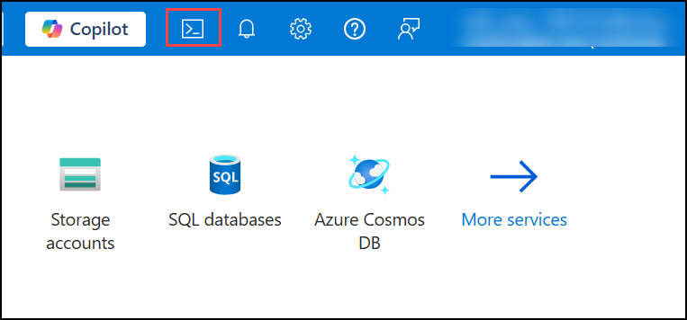
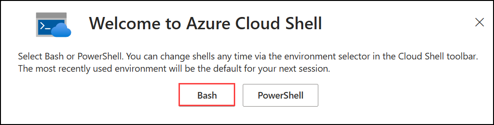
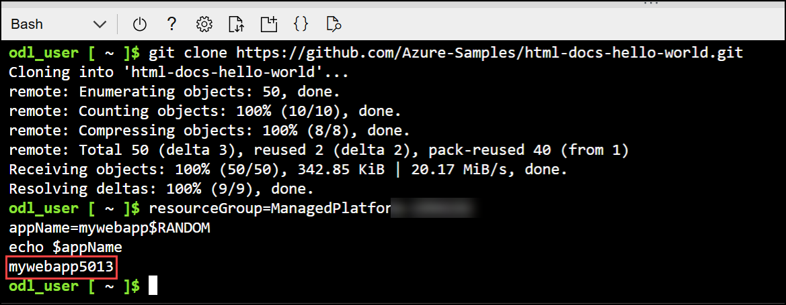
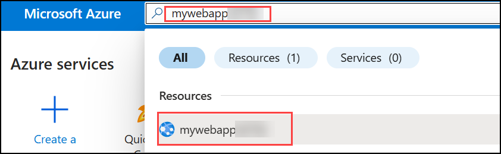
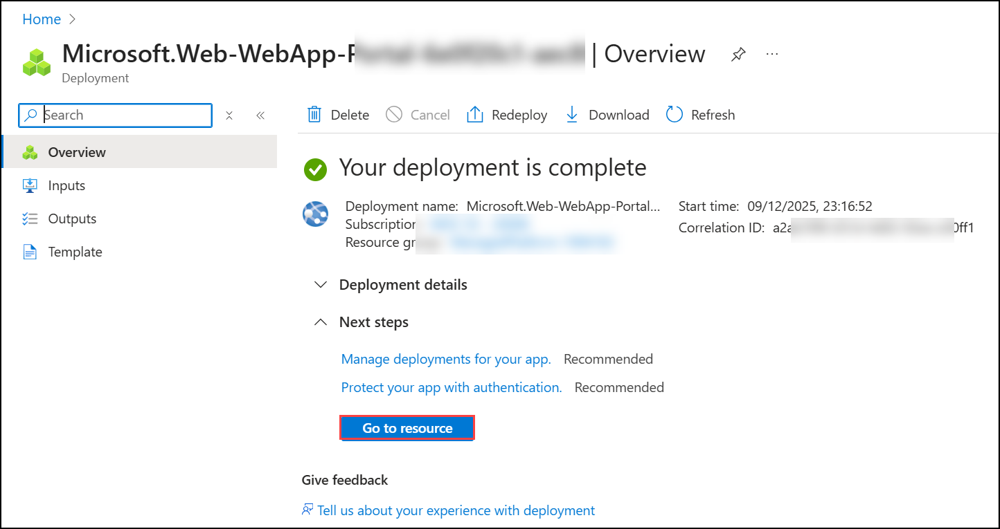
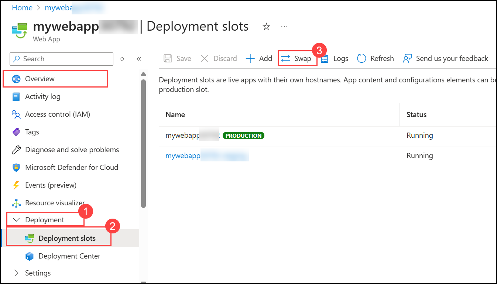
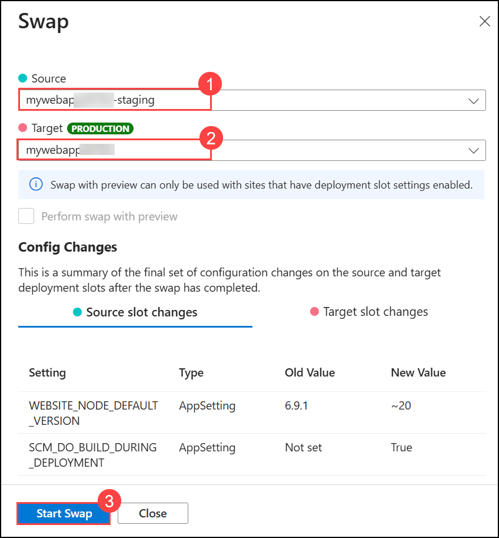
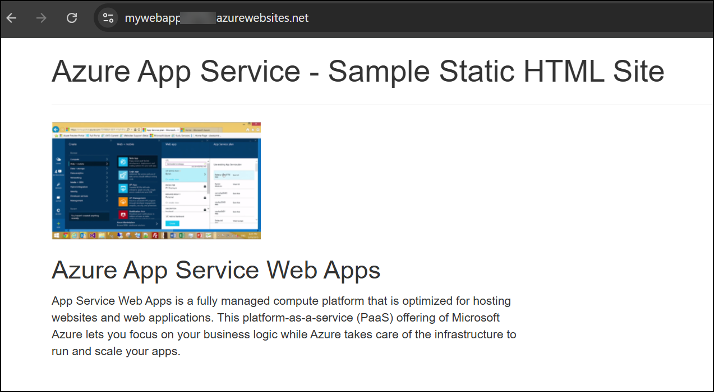

# Lab 04: Module 2: Swap Deployment Slots in Azure App Service

## Lab Scenario

In this exercise, you deploy a static HTML website to Azure App Service, create a staging deployment slot, make changes to the code and deploy them to the staging slot, and then swap the staging and production slots to promote the changes to production. You learn how to use deployment slots for safe application updates and blue-green deployments.

## Lab Objectives
In this lab, you will perform:

- Download and deploy the sample app to Azure App Service.
- Create a staging deployment slot.
- Make a change to the sample app and deploy it to the staging slot.
- Swap the staging and default production slots to move the changes to the production slot.

## Estimated timing: 30 minutes

# Exercise 1: Download and deploy the sample app

In this section you download the sample app, set variables to simplify commands, create an Azure App Service resource, and deploy a static HTML website using Azure CLI.

## Task 1: Prepare Cloud Shell and Clone Repository

1. Open **Cloud Shell**, choose **Bash**, select **No storage account required (1)**, choose the available **Subscription (2)**, and then click **Apply (3)** to continue.

    

    

    

2. Switch to **Classic version** in Cloud Shell.  

    

5. Run the following command to clone the sample app:

    ```bash
    git clone https://github.com/Azure-Samples/html-docs-hello-world.git
    ```

## Task 2: Set Variables

    ```bash
    resourceGroup=rg-mywebapp
    appName=mywebapp$RANDOM
    echo $appName
    ```



## Task 3: Deploy to App Service Using `az webapp up`

```bash
cd html-docs-hello-world
az webapp up -g $resourceGroup -n $appName --sku P0V3 --html
```

After deployment completes:

1. Search for the **mywebapp** using its name in the portal.



2. Open the app via the **Default domain** link.

    


---

# Exercise 2: Deploy Updated Code to a Deployment Slot

## Task 1: Create the Staging Slot

```bash
az webapp deployment slot create -n $appName -g $resourceGroup --slot staging
```

View the newly created slot:

- - In the Azure portal, open your **Web App**, then select **Deployment slots** from the left panel.


## Task 2: Modify Code and Deploy to Staging

1. Navigate back to CL and Open the HTML file by running the below code :

    ```bash
    code index.html
    ```

2. Change:

    `Azure App Service - Sample Static HTML Site`  
    to  
    `Azure App Service Staging Slot`

3. Save (**Ctrl+S**) and exit (**Ctrl+Q**).

4. Create a ZIP package:

```bash
zip -r stagingcode.zip .
```

5. Deploy to staging:

```bash
az webapp deploy -g $resourceGroup -n $appName --src-path ./stagingcode.zip --slot staging
```

6. Open the staging slot:

- In the Azure portal, go to **Deployment slots**, select **staging**, and open the **Default domain** link.

---

# Exercise 3: Swap the Staging and Production Slots

1. Select your **Web App**, then in the left panel open the **Deployment (1)** dropdown, go to **Deployment slots (2)**, and select **Swap (3)**. 



2. Set **Source** to **staging (1)**.  
3. Set **Target** to **production (2)**.  
4. Select **Start Swap (3)** to begin the process.  
5. Monitor the swap progress in the **Notifications** panel.  



6. Open the production site and verify that the updated heading appears (refresh the page if needed).



---

# Summary

In this lab, you:

- Deployed a static HTML website to Azure App Service.
- Created and deployed changes to a staging slot.
- Performed a slot swap to safely promote changes to production.

## You have successfully completed this lab.