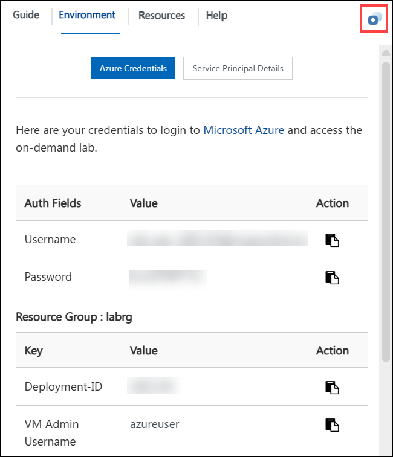
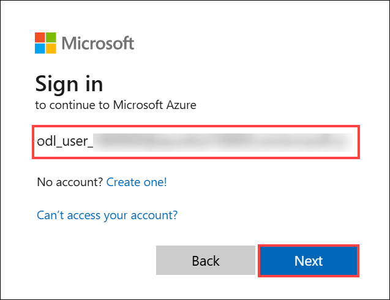
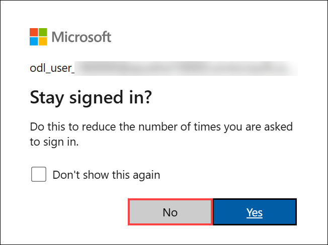

# Getting Started with Lab 04: Deploying and Managing Applications on Azure App Service

Welcome to **Lab 04**, which includes two modules focused on deploying containerized applications and managing deployment slots in Azure App Service.  
This Getting Started page provides all the essential environment setup instructions, navigation guidance, and support details needed before beginning the exercises.

---

## Lab Overview

Lab 04 is divided into two modules:

### **Module 1: Deploy a Containerized App to Azure App Service**
You will:
- Create an Azure App Service resource  
- Configure container settings  
- Deploy a containerized application  
- Verify the running application  

### **Module 2: Swap Deployment Slots in Azure App Service**
You will:
- Deploy a static HTML website  
- Create a staging deployment slot  
- Deploy updated code to the staging slot  
- Perform a slot swap to promote changes to production  

**Estimated Total Duration:** 45 minutes

---

## Accessing Your Lab Environment

Your CloudLabs environment includes a virtual machine and a built-in lab guide.

### Virtual Machine Access
Your VM loads on the left side of the CloudLabs interface:

### Lab Guide Access
The lab instructions appear on the right-hand panel.

---

## Exploring Lab Resources

Navigate to the **Environment** tab to view:
- Credentials  
- Resource details  
- Deployment information  

---

## Split-Window Feature

To open the lab guide in a separate browser window for better visibility, use the **Split Window** option:

---

## Managing Your Virtual Machine

You can start, stop, and restart your VM anytime from the **Resources** tab:

---

## Adjusting Zoom

Control the zoom level of the lab environment using the **A↕ 100%** button located near the session timer:

---

## Accessing Azure Portal

Follow these steps to begin working with Azure resources:

1. Select the **Azure Portal** icon from the VM desktop:

   

2. Sign in using the credentials provided in your lab environment:
   - **Email/Username:** `<inject key="AzureAdUserEmail"></inject>`

     

3. Enter your password:
   - **Password:** `<inject key="AzureAdUserPassword"></inject>`

     

4. If asked **Stay signed in?**, choose **No**.

   

---

## Support

CloudLabs offers dedicated **24/7 learner support** for any issues encountered, including:
- VM not loading  
- Azure access issues  
- CLI authentication problems  
- Deployment failures  

**Contact Information:**
- Email: cloudlabs-support@spektrasystems.com  
- Live Chat: https://cloudlabs.ai/labs-support  

---

## Move to the Next Page

After completing your environment setup, click **Next** at the bottom-right corner to begin the lab exercises.

## Happy Learning!