# Lab 5: Azure container services

## Lab Scenario

In this exercise, you build a container image from your application code and push it to Azure Container Registry using Azure CLI. You learn how to prepare your app for containerization, create an ACR instance, and store your container image in Azure.

## Lab Objectives

In this lab, you will perform:

* Task 1: Create an Azure Container Registry resource
* Task 2: Build and push an image from a Dockerfile
* Task 3: Verify the results
* Task 4: Run the image in the Azure Container Registry

## Estimated Timing: 20 Minutes

## Exercise 1: Build and run a container image with Azure Container Registry Tasks

### Task 1: Create an Azure Container Registry resource

In this task, you will create an Azure Container Registry instance that will store and manage your container images.

1. In the lab VM, click on the **Azure Portal icon** as shown below:

    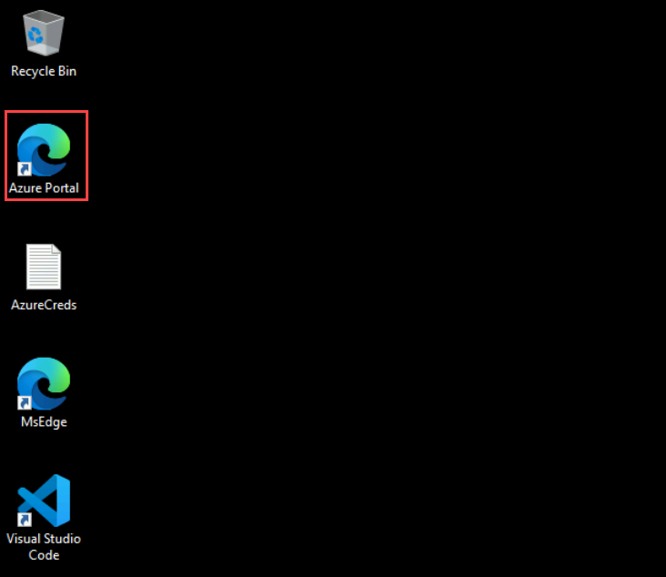

    - On the **Sign in to Microsoft Azure** tab, you will see the login screen. Enter your credentials:
      
        * **Email/Username:** <inject key="AzureAdUserEmail"></inject>
    
    - Next, provide your password:

        * **Temporary Access Pass:** <inject key="AzureAdUserPassword"></inject>


1. On the Azure portal homepage, click the **\[>\_] Cloud Shell (1)** button located to the right of the **Copilot** tab at the top. This opens a new Cloud Shell session. In the **Welcome to Azure Cloud Shell** window, choose **Bash (2)**.

    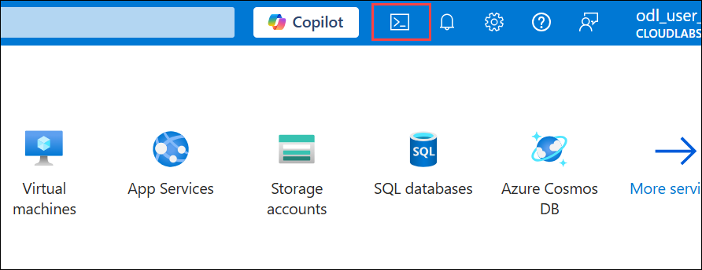

    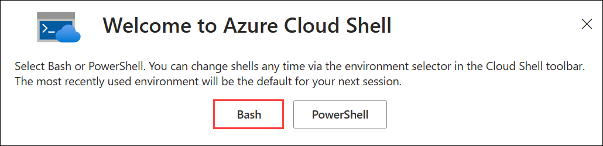

1. In the **Getting started** window, ensure **No storage account required (1)** is selected. From the **Subscription** drop-down, choose **Default subscription (2)**, then click **Apply (3)**.
   
    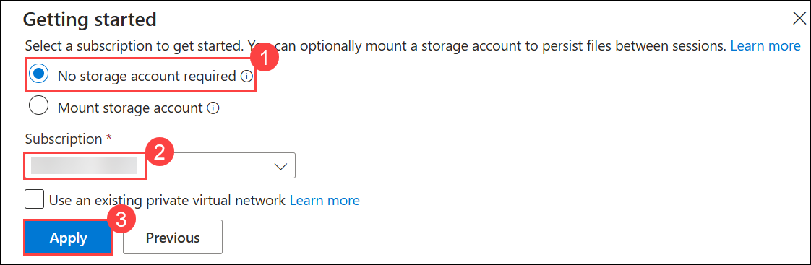

1. Run the following command to create a basic container registry. The registry name must be unique within Azure, and contain 5-50 numeric and lowercase characters. 

    ```bash
    az acr create --resource-group ConfidentialStack-<inject key="DeploymentID" enableCopy="false"/> \
        --name mycontainerregistry<inject key="DeploymentID" enableCopy="false"/> --sku Basic
    ```

     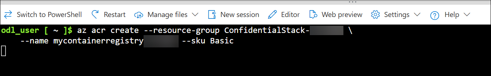

     > **Note:** The command creates a *Basic* registry, a cost-optimized option for developers learning about Azure Container Registry.

> **Congratulations** on completing the task! Now, it's time to validate it. Here are the steps:
> - If you receive a success message, you can proceed to the next task.

<validation step="dd962eb8-d886-4bb8-a640-e9bf11f0668a" />

### Task 2: Build and push an image from a Dockerfile

In this task, you will build a container image from a simple Dockerfile and push it directly to your Azure Container Registry using ACR Tasks.

1. Run the following command to create the Dockerfile. The Dockerfile contains a single line that references the *hello-world* image hosted at the Microsoft Container Registry.

    ```bash
    echo FROM mcr.microsoft.com/hello-world > Dockerfile
    ```

1. Run the following **az acr build** command, which builds the image and, after the image is successfully built, pushes it to your registry.

    ```bash
    az acr build --image sample/hello-world:v1  \
        --registry mycontainerregistry<inject key="DeploymentID" enableCopy="false"/> \
        --file Dockerfile .
    ```

    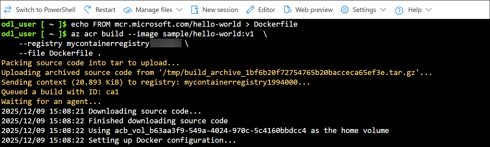

 1. Following is a shortened sample of the output from the previous command showing the last few lines with the final results. You can see in the *repository* field the *sample/hello-word* image is listed.

    ```
    - image:
        registry: myContainerRegistry.azurecr.io
        repository: sample/hello-world
        tag: v1
        digest: sha256:92c7f9c92844bbbb5d0a101b22f7c2a7949e40f8ea90c8b3bc396879d95e899a
      runtime-dependency:
        registry: mcr.microsoft.com
        repository: hello-world
        tag: latest
        digest: sha256:92c7f9c92844bbbb5d0a101b22f7c2a7949e40f8ea90c8b3bc396879d95e899a
      git: {}
    
    
    Run ID: cf1 was successful after 11s
    ```

    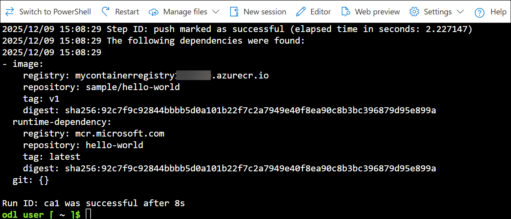

### Task 3: Verify the results

In this task, you will verify that your image was successfully pushed by listing repositories and tags stored in your Azure Container Registry.

1. Run the following command to list the repositories in your registry.

    ```bash
    az acr repository list --name mycontainerregistry<inject key="DeploymentID" enableCopy="false"/> --output table
    ```

    Output:

    ```
    Result
    ----------------
    sample/hello-world
    ```

    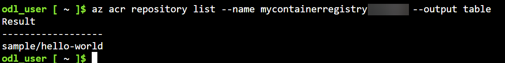

1. Run the following command to list the tags on the **sample/hello-world** repository.

    ```bash
    az acr repository show-tags --name mycontainerregistry<inject key="DeploymentID" enableCopy="false"/> \
        --repository sample/hello-world --output table
    ```

    Output:

    ```
    Result
    --------
    v1
    ```

    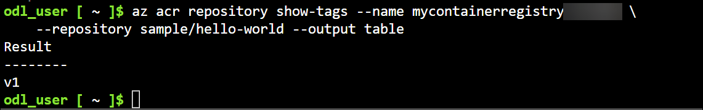

### Task 4: Run the image in the ACR

In this task, you will run the container image directly from Azure Container Registry using the az acr run command to confirm the image works as expected.

1. Run the *sample/hello-world:v1* container image from your container registry with the **az acr run** command. The following example uses **$Registry** to specify the registry where you run the command. 

    ```bash
    az acr run --registry mycontainerregistry<inject key="DeploymentID" enableCopy="false"/> \
        --cmd '$Registry/sample/hello-world:v1' /dev/null
    ```

    The **cmd** parameter in this example runs the container in its default configuration, but **cmd** supports other **docker run** parameters or even other **docker** commands. 

    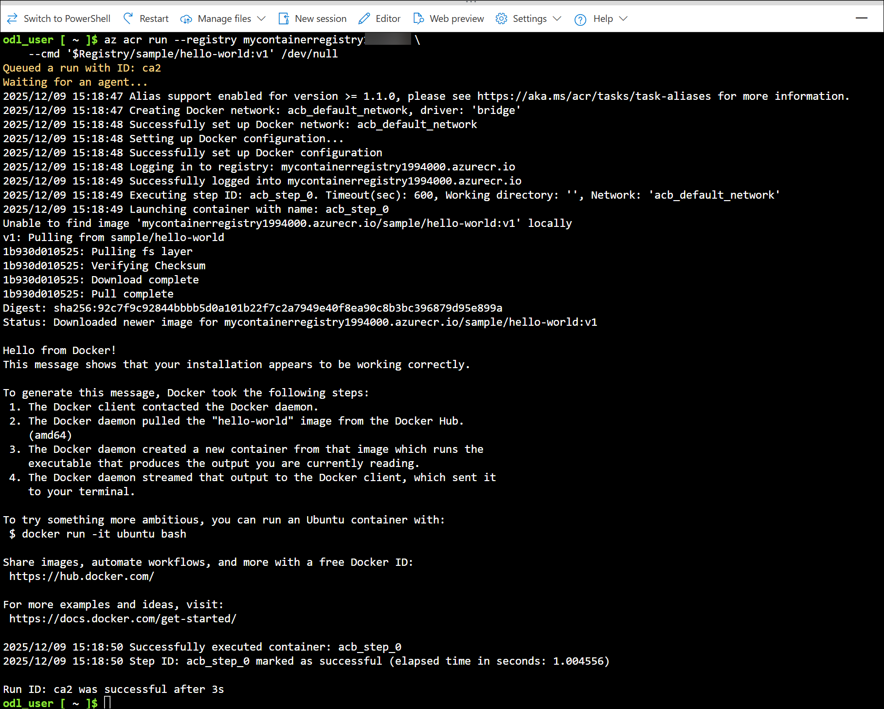

## Summary

In this lab, you:

- Created an Azure Container Registry to store and manage container images

- Built a container image from a Dockerfile and pushed it to your registry using ACR Tasks

- Verified the uploaded image by listing repositories and tags in the registry

- Ran the container image directly in Azure Container Registry to confirm successful execution

## You have successfully completed the lab. Click on Next >>

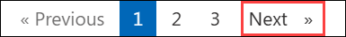