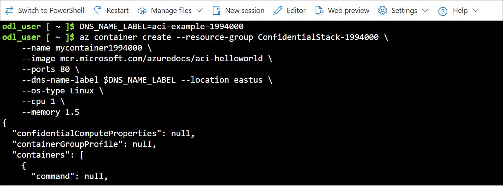
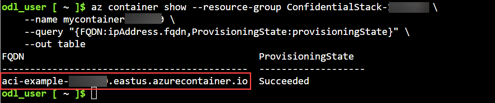
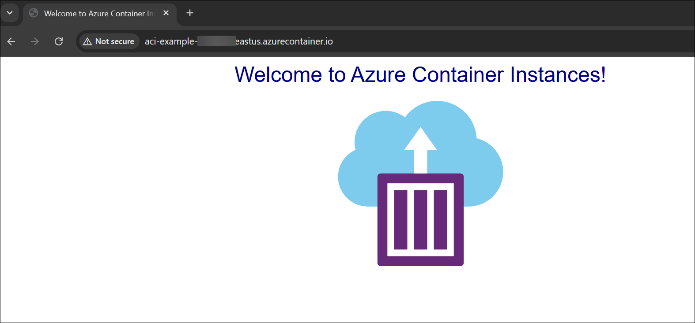

## Exercise 2: Deploy a container to Azure Container Instances using Azure CLI commands

## Lab Scenario

In this exercise, you deploy and run a container in Azure Container Instances (ACI) using Azure CLI. You learn how to create a container group, specify container settings, and verify that your containerized application is running in the cloud.

## Lab Objectives
In this lab, you will perform:

* Task 1: Create and deploy a container
* Task 2: Verify the container is running

## Estimated Timing: 15 Minutes

### Task 1: Create and deploy a container

In this task, you will create and deploy a container instance in Azure Container Instances by specifying its name, image, ports, and DNS label.

1. Run the following command to create a DNS name used to expose your container to the Internet. Your DNS name must be unique, run this command from Cloud Shell to create a variable that holds a unique name.

    ```bash
    DNS_NAME_LABEL=aci-example-<inject key="DeploymentID" enableCopy="false"/>
    ```

1. Run the following command to create a container instance. It takes a few minutes for the operation to complete.

    ```bash
    az container create --resource-group ConfidentialStack-<inject key="DeploymentID" enableCopy="false"/> \
        --name mycontainer<inject key="DeploymentID" enableCopy="false"/> \
        --image mcr.microsoft.com/azuredocs/aci-helloworld \
        --ports 80 \
        --dns-name-label $DNS_NAME_LABEL --location <inject key="Region" enableCopy="false"/> \
        --os-type Linux \
        --cpu 1 \
        --memory 1.5 
    ```

     

     >**Note:** In the previous command, **$DNS_NAME_LABEL** specifies your DNS name. The image name, **mcr.microsoft.com/azuredocs/aci-helloworld**, refers to a Docker image that runs a basic Node.js web application.

> **Congratulations** on completing the task! Now, it's time to validate it. Here are the steps:
> - If you receive a success message, you can proceed to the next task.

<validation step="2b5eee32-b290-4c07-ae35-fccf6d8d65c8" />

### Task 2: Verify the container is running

In this task, you will verify that your container is running by checking its provisioning status and accessing the container through its fully qualified domain name.

1. Run the following command to check the provisioning status of the container you created. 

    ```bash
    az container show --resource-group ConfidentialStack-<inject key="DeploymentID" enableCopy="false"/> \
        --name mycontainer<inject key="DeploymentID" enableCopy="false"/> \
        --query "{FQDN:ipAddress.fqdn,ProvisioningState:provisioningState}" \
        --out table 
    ```

     
    
1. You see your container's fully qualified domain name (FQDN) and its provisioning state. Here's an example.

    ```
    FQDN                                    ProvisioningState
    --------------------------------------  -------------------
    aci-wt.eastus.azurecontainer.io         Succeeded
    ```

    > **Note:** If your container is in the **Creating** state, wait a few moments and run the command again until you see the **Succeeded** state.

1. From a browser, navigate to your container's FQDN to see it running. You may get a warning that the site isn't safe.

     

## Summary

In this lab, you:

- Created and deployed a container instance in Azure Container Instances using the Azure CLI

- Verified the container’s provisioning status and accessed its fully qualified domain name to confirm it was running successfully

## You have successfully completed the lab. Click on Next >>

