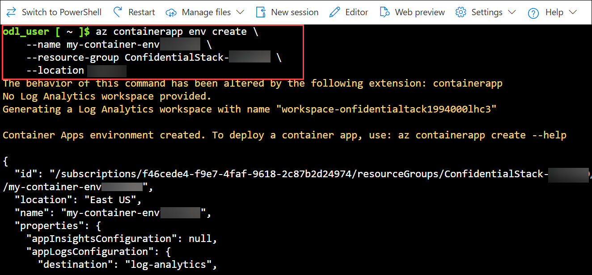
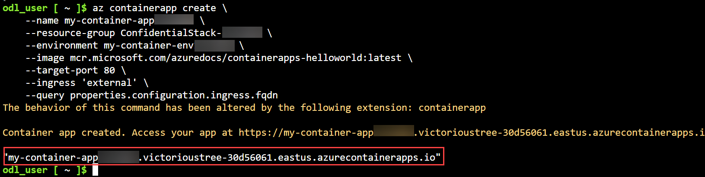
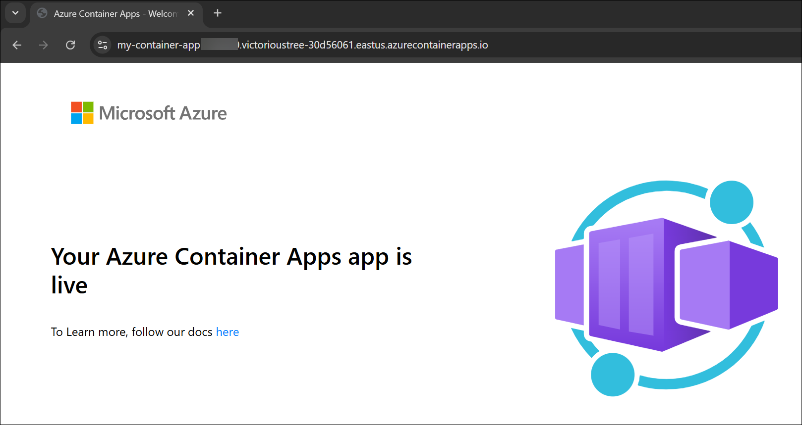

## Exercise 3: Deploy a container to Azure Container Apps with the Azure CLI

## Lab Scenario

In this exercise, you deploy a containerized application to Azure Container Apps using Azure CLI. You learn how to create a container app environment, deploy your container, and verify that your application is running in Azure.

## Lab Objectives

In this lab, you will perform:

* Task 1: Create an Azure Container Apps environment
* Task 2: Deploy a container app to the environment

## Estimated Timing: 15 Minutes

### Task 1: Create an Azure Container Apps environment

In this task, you will create an Azure Container Apps environment that provides the secure and shared infrastructure needed to host your container apps.

1. Run the following command to ensure you have the latest version of the Azure Container Apps extension for the CLI is installed.

    ```azurecli
    az extension add --name containerapp --upgrade
    ```

1. Create an environment with the **az containerapp env create** command. It takes a few minutes for the operation to complete.

    ```bash
    az containerapp env create \
        --name my-container-env<inject key="DeploymentID" enableCopy="false"/> \
        --resource-group ConfidentialStack-<inject key="DeploymentID" enableCopy="false"/> \
        --location <inject key="Region" enableCopy="false"/>
    ```

     

### Task 2: Deploy a container app to the environment

In this task, you will deploy a containerized application into your Container Apps environment and verify that it is accessible through its public endpoint.

1. Deploy a sample app container image with the **containerapp create** command.

    ```bash
    az containerapp create \
        --name my-container-app<inject key="DeploymentID" enableCopy="false"/> \
        --resource-group ConfidentialStack-<inject key="DeploymentID" enableCopy="false"/> \
        --environment my-container-env<inject key="DeploymentID" enableCopy="false"/> \
        --image mcr.microsoft.com/azuredocs/containerapps-helloworld:latest \
        --target-port 80 \
        --ingress 'external' \
        --query properties.configuration.ingress.fqdn
    ```

    

    By setting **--ingress** to **external**, you make the container app available to public requests. The command returns a link to access your app.

    ```
    Container app created. Access your app at <url>
    ```

1. To verify the deployment select the URL returned by the **az containerapp create** command to verify the container app is running.

    

## Summary

In this lab, you:

- Created an Azure Container Apps environment to host containerized applications

- Deployed a container app to the environment and verified that it was running by accessing its public endpoint

## You have successfully completed the lab.