# Lab 06: Create resources in Azure Cosmos DB for NoSQL using .NET

## Lab overview

In this exercise, you create an Azure Cosmos DB account and build a .NET console application that uses the Microsoft Azure Cosmos DB SDK to create a database, container, and sample item. You learn how to configure authentication, perform database operations programmatically, and verify your results in the Azure portal.

## Lab Objectives

In this lab, you will perform:

- Task 1: Create an Azure Cosmos DB account
- Task 2: Create a .NET console app and add required implementation code
- Task 3: Run the application and verify results

## Exercise 1: Create resources in Azure Cosmos DB for NoSQL using .NET

### Task 1: Create an Azure Cosmos DB account

1. Open **Cloud Shell**, choose **Bash**, select **No storage account required (1)**, choose the available **Subscription (2)**, and then click **Apply (3)** to continue.

    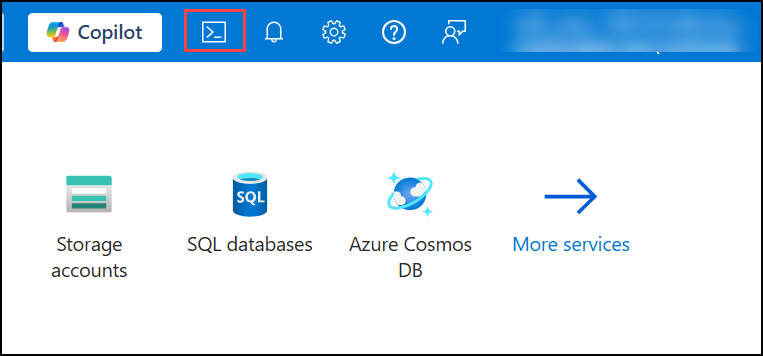

    

    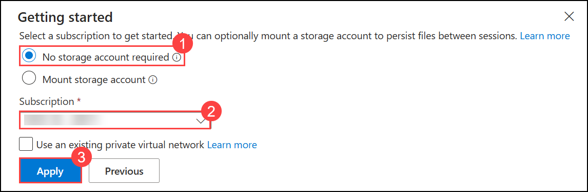

2. Switch to **Classic version** in Cloud Shell.  

    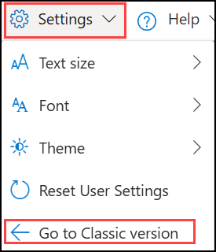

5. Create variables:

```
resourceGroup=myResourceGroup
accountName=cosmosexercise$RANDOM
```

6. Create the Cosmos DB account:

```
az cosmosdb create --name $accountName --resource-group $resourceGroup
```

7. Retrieve the endpoint:

```
az cosmosdb show --name $accountName --resource-group $resourceGroup --query "documentEndpoint" --output tsv
```

8. Retrieve the primary key:

```
az cosmosdb keys list --name $accountName --resource-group $resourceGroup --query "primaryMasterKey" --output tsv
```
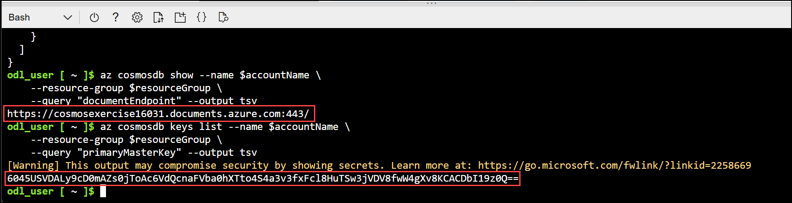
---

### Task 2: Create a .NET console app and add required implementation code

1. Create project folder:

```
mkdir cosmosdb
cd cosmosdb
```

2. Create the .NET console app:

```
dotnet new console
```

3. Add required packages:

```
dotnet add package Microsoft.Azure.Cosmos --version 3.*
dotnet add package Newtonsoft.Json --version 13.*
dotnet add package dotenv.net
```

4. Create `.env` file:

```
touch .env
code .env
```

Add:

```
DOCUMENT_ENDPOINT="YOUR_DOCUMENT_ENDPOINT"
ACCOUNT_KEY="YOUR_ACCOUNT_KEY"
```

5. Replace code in **Program.cs** with the template code and add required implementation blocks.

    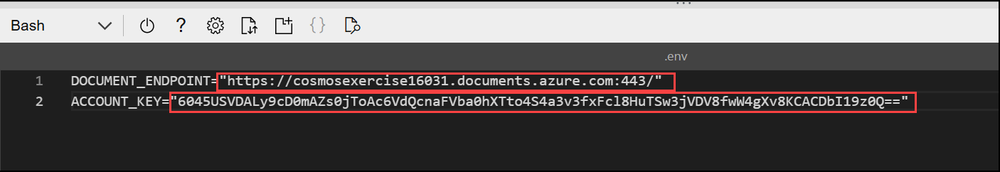

---

### Add required implementation code

Insert each code block into the appropriate location in **Program.cs**:

#### **Create the Cosmos DB client**

```csharp
CosmosClient client = new(
    accountEndpoint: cosmosDbAccountUrl,
    authKeyOrResourceToken: accountKey
);
```

#### **Create Database**

```csharp
Database database = await client.CreateDatabaseIfNotExistsAsync(databaseName);
Console.WriteLine($"Created or retrieved database: {database.Id}");
```

#### **Create Container**

```csharp
Container container = await database.CreateContainerIfNotExistsAsync(
    id: containerName,
    partitionKeyPath: "/id"
);
Console.WriteLine($"Created or retrieved container: {container.Id}");
```

#### **Define Product Item**

```csharp
Product newItem = new Product
{
    id = Guid.NewGuid().ToString(),
    name = "Sample Item",
    description = "This is a sample item in my Azure Cosmos DB exercise."
};
```

#### **Add Item to Container**

```csharp
ItemResponse<Product> createResponse = await container.CreateItemAsync(
    item: newItem,
    partitionKey: new PartitionKey(newItem.id)
);

Console.WriteLine($"Created item with ID: {createResponse.Resource.id}");
Console.WriteLine($"Request charge: {createResponse.RequestCharge} RUs");
```

1. Now that the code is complete. Verify it with below code, save your progress use **ctrl + s** to save the file, and **ctrl + q** to exit the editor.

    ```
    using Microsoft.Azure.Cosmos;
    using dotenv.net;

    string databaseName = "myDatabase"; // Name of the database to create or use
    string containerName = "myContainer"; // Name of the container to create or use

    // Load environment variables from .env file
    DotEnv.Load();
    var envVars = DotEnv.Read();
    string cosmosDbAccountUrl = envVars["DOCUMENT_ENDPOINT"];
    string accountKey = envVars["ACCOUNT_KEY"];

    if (string.IsNullOrEmpty(cosmosDbAccountUrl) || string.IsNullOrEmpty(accountKey))
    {
        Console.WriteLine("Please set the DOCUMENT_ENDPOINT and ACCOUNT_KEY environment variables.");
        return;
    }

    // CREATE THE COSMOS DB CLIENT USING THE ACCOUNT URL AND KEY
    CosmosClient client = new(
        accountEndpoint: cosmosDbAccountUrl,
        authKeyOrResourceToken: accountKey
    );

    try
    {
        // CREATE A DATABASE IF IT DOESN'T ALREADY EXIST
        Database database = await client.CreateDatabaseIfNotExistsAsync(databaseName);
        Console.WriteLine($"Created or retrieved database: {database.Id}");

        // CREATE A CONTAINER WITH A SPECIFIED PARTITION KEY
        Container container = await database.CreateContainerIfNotExistsAsync(
            id: containerName,
            partitionKeyPath: "/id"
        );
        Console.WriteLine($"Created or retrieved container: {container.Id}");

        // DEFINE A TYPED ITEM (PRODUCT) TO ADD TO THE CONTAINER
        Product newItem = new Product
        {
            id = Guid.NewGuid().ToString(), // Generate a unique ID for the product
            name = "Sample Item",
            description = "This is a sample item in my Azure Cosmos DB exercise."
        };

        // ADD THE ITEM TO THE CONTAINER
        ItemResponse<Product> createResponse = await container.CreateItemAsync(
            item: newItem,
            partitionKey: new PartitionKey(newItem.id)
        );

        Console.WriteLine($"Created item with ID: {createResponse.Resource.id}");
        Console.WriteLine($"Request charge: {createResponse.RequestCharge} RUs");

    }
    catch (CosmosException ex)
    {
        // Handle Cosmos DB-specific exceptions
        // Log the status code and error message for debugging
        Console.WriteLine($"Cosmos DB Error: {ex.StatusCode} - {ex.Message}");
    }
    catch (Exception ex)
    {
        // Handle general exceptions
        // Log the error message for debugging
        Console.WriteLine($"Error: {ex.Message}");
    }

    // This class represents a product in the Cosmos DB container
    public class Product
    {
        public string? id { get; set; }
        public string? name { get; set; }
        public string? description { get; set; }
    }
    ```
---
- Output :

  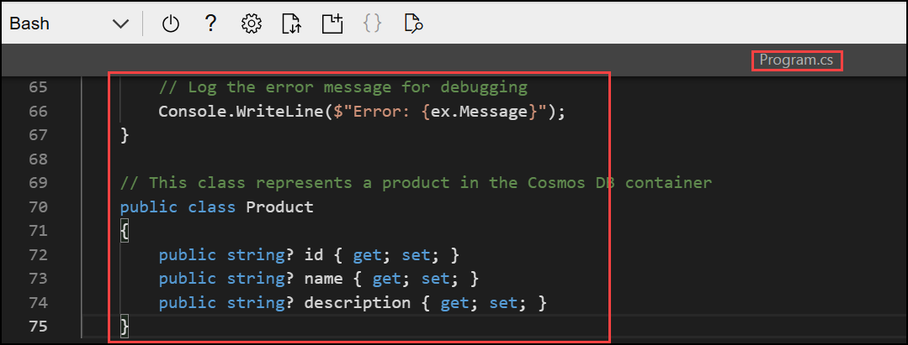

### Validate the full code using:

```
dotnet build
```

---

### Task 3: Run the application and verify results

```
dotnet run
```

Sample output:

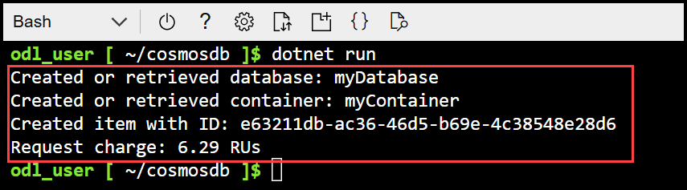

### Verify the item in Azure Cosmos DB

1. Go to **Azure Portal** and open the Resource Group **CosmosDB-<inject key="DeploymentID" enableCopy="false"/> (1)**.

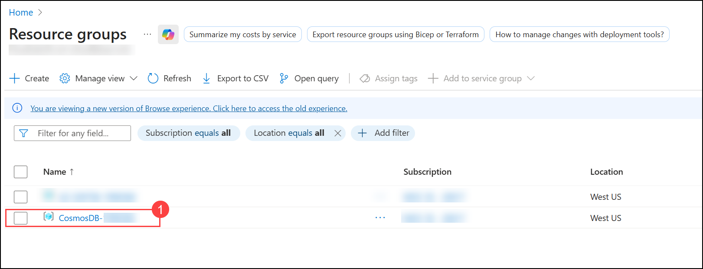

2. In the resource group, select the **Azure Cosmos DB account** that was created **(2)**.

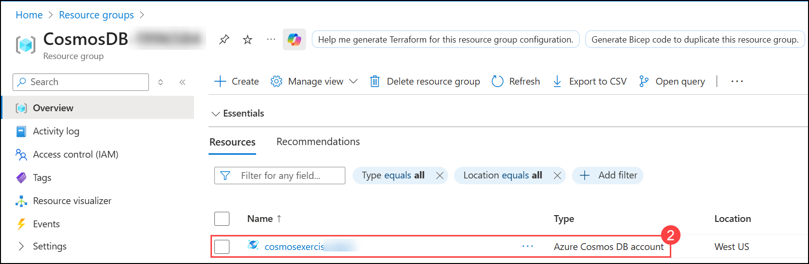

3. Open **Data Explorer (3)**.

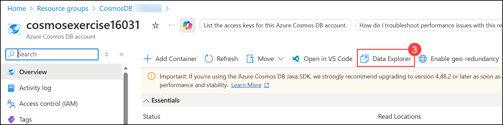

4. Under **myDatabase (4)**, expand the dropdown, select **myContainer (5)**, then open **Items (6)** — you will see the created result **(7)**.

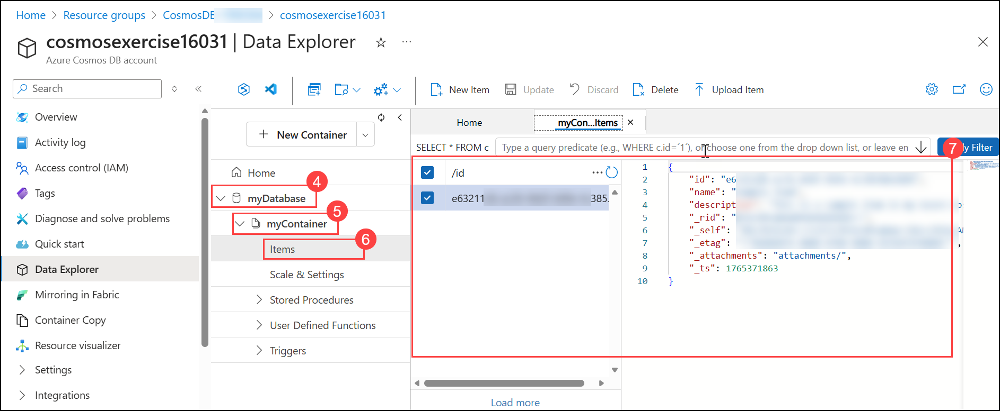

---
## Summary
You successfully:
- Created a Cosmos DB account  
- Built a .NET application that interacts with Cosmos DB  
- Inserted and validated data programmatically  

## You have successfully completed this lab.