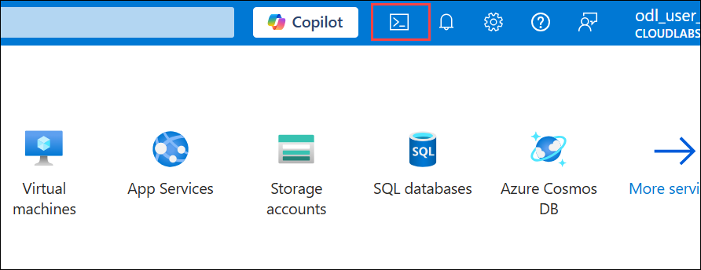
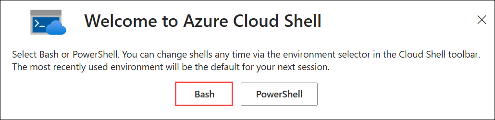
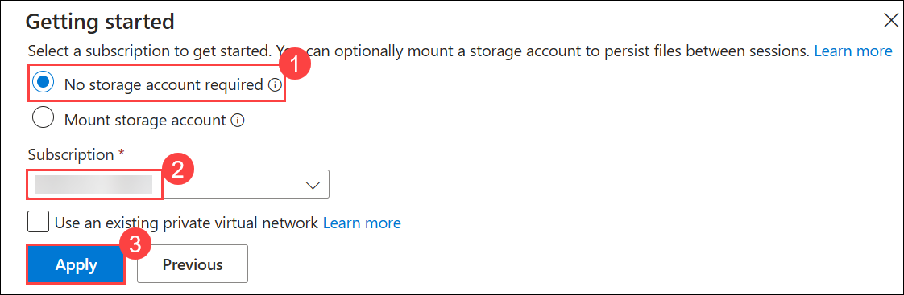
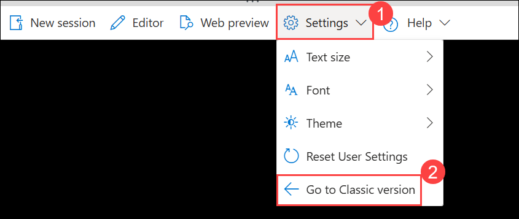
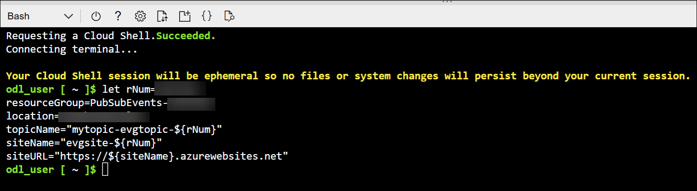
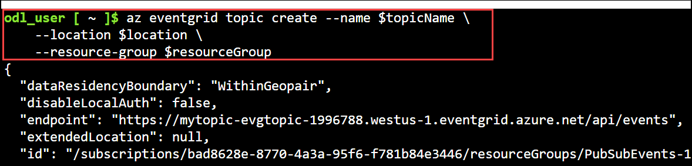
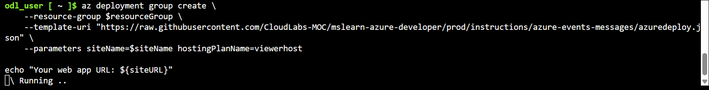
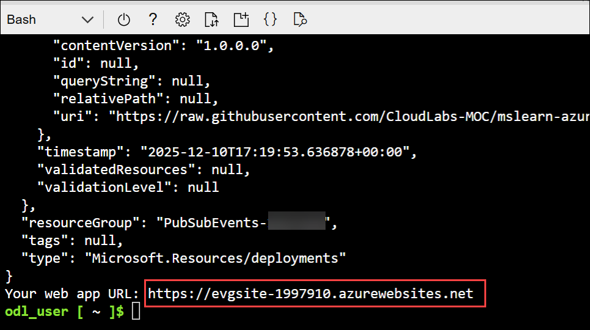
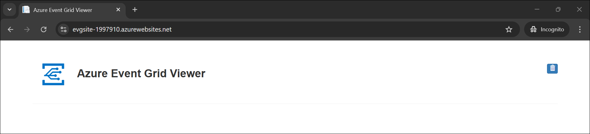

# Lab 7: Azure events and messaging

## Lab Scenario

In this exercise, you create an Azure Event Grid topic and a web app endpoint, then build a .NET console application that sends custom events to the Event Grid topic. You learn how to configure event subscriptions, authenticate with Event Grid, and verify that your events are successfully routed to the endpoint by viewing them in the web app.

## Lab Objectives
In this lab, you will perform:

* Task 1: Create Azure Event Grid resources
* Task 2: Create a message endpoint
* Task 3: Subscribe to the topic
* Task 4: Send an event with a .NET console application
* Task 5: Configure the console application
* Task 6: Add the code for the project
* Task 7: Sign into Azure and run the app

This exercise takes approximately **30** minutes to complete.

## Exercise 1: Route events to a custom endpoint with Azure Event Grid

### Task 1: Create Azure Event Grid resources

In this section of the exercise you create the needed resources in Azure with the Azure CLI.

1. In your browser navigate to the Azure portal [https://portal.azure.com](https://portal.azure.com); signing in with your Azure credentials if prompted.

1. On the Azure portal homepage, click the **\[>\_] Cloud Shell (1)** button located to the right of the **Copilot** tab at the top. This opens a new Cloud Shell session. In the **Welcome to Azure Cloud Shell** window, choose **Bash (2)**.

    

    

1. In the **Getting started** window, ensure **No storage account required (1)** is selected. From the **Subscription** drop-down, choose **Default subscription (2)**, then click **Apply (3)**.
   
    

    > **Note:** If you have previously created a cloud shell that uses a *PowerShell* environment, switch it to ***Bash***.

1. In the cloud shell toolbar, in the **Settings** menu, select **Go to Classic version** (this is required to use the code editor).

     

1. Many of the commands require unique names and use the same parameters. Creating some variables will reduce the changes needed to the commands that create resources. Run the following commands to create the needed variables. 

    ```bash
    let rNum=<inject key="DeploymentID" enableCopy="false"/>
    resourceGroup=PubSubEvents-<inject key="DeploymentID" enableCopy="false"/>
    location=<inject key="Region" enableCopy="false"/>
    topicName="mytopic-evgtopic-${rNum}"
    siteName="evgsite-${rNum}"
    siteURL="https://${siteName}.azurewebsites.net"
    ```

     

1. Create a topic by using the **az eventgrid topic create** command. The name must be unique because it's part of the DNS entry.  

    ```bash
    az eventgrid topic create --name $topicName \
        --location $location \
        --resource-group $resourceGroup
    ```

    

### Task 2: Create a message endpoint

Before subscribing to the custom topic, we need to create the endpoint for the event message. Typically, the endpoint takes actions based on the event data. The following script uses a prebuilt web app that displays the event messages. The deployed solution includes an App Service plan, an App Service web app, and source code from GitHub.

1. Run the following commands to create a message endpoint. The **echo** command will display the site URL for the endpoint.

    ```bash
    az deployment group create \
        --resource-group $resourceGroup \
        --template-uri "https://raw.githubusercontent.com/CloudLabs-MOC/mslearn-azure-developer/prod/instructions/azure-events-messages/azuredeploy.json" \
        --parameters siteName=$siteName hostingPlanName=viewerhost
    
    echo "Your web app URL: ${siteURL}"
    ```

     

    > **Note:** This command may take a few minutes to complete.

1. Open a new tab in your browser and navigate to the URL generated at the end of the previous script to ensure the web app is running. You should see the site with no messages currently displayed.

    

    

    > **Tip:** Leave the browser running, it is used to show updates.

### Task 3: Subscribe to the topic

You subscribe to an Event Grid topic to tell Event Grid which events you want to track and where to send those events. 

1. Subscribe to a topic using the **az eventgrid event-subscription create** command. The following script retrieves the subscription ID from your account and uses it in the creation of the event subscription.

    ```bash
    endpoint="${siteURL}/api/updates"
    topicId=$(az eventgrid topic show --resource-group $resourceGroup \
        --name $topicName --query "id" --output tsv)
    
    az eventgrid event-subscription create \
        --source-resource-id $topicId \
        --name TopicSubscription \
        --endpoint $endpoint
    ```

1. View your web app again, and notice that a subscription validation event has been sent to it. Select the eye icon to expand the event data. Event Grid sends the validation event so the endpoint can verify that it wants to receive event data. The web app includes code to validate the subscription.

### Task 4: Send an event with a .NET console application

Now that the needed resources are deployed to Azure the next step is to set up the console application. The following steps are performed in the cloud shell.

>**Tip:** Resize the cloud shell to display more information, and code, by dragging the top border. You can also use the minimize and maximize buttons to switch between the cloud shell and the main portal interface.

1. Run the following commands to create a directory to contain the project and change into the project directory.

    ```bash
    mkdir eventgrid
    cd eventgrid
    ```

1. Create the .NET console application.

    ```bash
    dotnet new console
    ```

1. Run the following commands to add the **Azure.Messaging.EventGrid** and **dotenv.net** packages to the project.

    ```bash
    dotnet add package Azure.Messaging.EventGrid
    dotnet add package dotenv.net
    ```

### Task 5: Configure the console application

In this section you retrieve the topic endpoint and access key so they can be added to a **.env** file to hold those secrets.

1. Run the following commands to retrieve the URL and access key for the topic you created earlier. Be sure to record these values.

    ```bash
    az eventgrid topic show --name $topicName -g $resourceGroup --query "endpoint" --output tsv
    az eventgrid topic key list --name $topicName -g $resourceGroup --query "key1" --output tsv
    ```

1. Run the following command to create the **.env** file to hold the secrets, and then open it in the code editor.

    ```bash
    touch .env
    code .env
    ```

1. Add the following code to the **.env** file. Replace **YOUR_TOPIC_ENDPOINT** and **YOUR_TOPIC_ACCESS_KEY** with the values you recorded earlier.

    ```
    TOPIC_ENDPOINT="YOUR_TOPIC_ENDPOINT"
    TOPIC_ACCESS_KEY="YOUR_TOPIC_ACCESS_KEY"
    ```

1. Press **ctrl+s** to save the file, then **ctrl+q** to exit the editor.

Now it's time to replace the template code in the **Program.cs** file using the editor in the cloud shell.

### Task 6: Add the code for the project

1. Run the following command in the cloud shell to begin editing the application.

    ```bash
    code Program.cs
    ```

1. Replace any existing code with the following code. Be sure to review the comments in the code.

    ```csharp
    using dotenv.net; 
    using Azure.Messaging.EventGrid; 
    
    // Load environment variables from .env file
    DotEnv.Load();
    var envVars = DotEnv.Read();
    
    // Start the asynchronous process to send an Event Grid event
    ProcessAsync().GetAwaiter().GetResult();
    
    async Task ProcessAsync()
    {
        // Retrieve Event Grid topic endpoint and access key from environment variables
        var topicEndpoint = envVars["TOPIC_ENDPOINT"];
        var topicKey = envVars["TOPIC_ACCESS_KEY"];
        
        // Check if the required environment variables are set
        if (string.IsNullOrEmpty(topicEndpoint) || string.IsNullOrEmpty(topicKey))
        {
            Console.WriteLine("Please set TOPIC_ENDPOINT and TOPIC_ACCESS_KEY in your .env file.");
            return;
        }
    
        // Create an EventGridPublisherClient to send events to the specified topic
        EventGridPublisherClient client = new EventGridPublisherClient
            (new Uri(topicEndpoint),
            new Azure.AzureKeyCredential(topicKey));
    
        // Create a new EventGridEvent with sample data
        var eventGridEvent = new EventGridEvent(
            subject: "ExampleSubject",
            eventType: "ExampleEventType",
            dataVersion: "1.0",
            data: new { Message = "Hello, Event Grid!" }
        );
    
        // Send the event to Azure Event Grid
        await client.SendEventAsync(eventGridEvent);
        Console.WriteLine("Event sent successfully.");
    }
    ```

1. Press **ctrl+s** to save the file, then **ctrl+q** to exit the editor.

### Task 7: Sign into Azure and run the app

1. In the cloud shell command-line pane, enter the following command to sign into Azure.

    ```
    az login
    ```

    **<font color="red">You must sign into Azure - even though the cloud shell session is already authenticated.</font>**

    > **Note**: In most scenarios, just using *az login* will be sufficient. However, if you have subscriptions in multiple tenants, you may need to specify the tenant by using the *--tenant* parameter. See [Sign into Azure interactively using Azure CLI](https://learn.microsoft.com/cli/azure/authenticate-azure-cli-interactively) for details.

1. Run the following command in the cloud shell to start the console application. You will see the message **Event sent successfully.** when the message is sent.

    ```bash
    dotnet run
    ```

1. View your web app to see the event you just sent. Select the eye icon to expand the event data.

